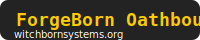

# ForgeBorn License

*A Witchborn Systems Attribution Oath*

---

**This repo contains the ForgeBorn License and all related Oathbound documentation for Witchborn Systems projects, AI/ML models, tools, art, and code.**

---

## The Spirit

Inspired by the **FlameKeeper’s Vow**:
Build with honor, share with transparency, and always credit your source.
If you profit, resell, or want to go big, talk to the maker. If you build with respect, you are Oathbound.

---

## What’s Covered

**The ForgeBorn License applies to:**

* Code (source, binaries, plugins, scripts)
* AI/ML models, weights, datasets, and training data
* Prompts, configuration files, hyperparameters
* Generated content (text, images, audio, video, art, code, etc.)
* Documentation, research, metadata, and creative works

---

## Key Principles

* **Free to use, remix, share, and build with**
* **Always credit your source** — no burying or hiding attribution
* **SaaS and public endpoints are allowed** as long as credit is clear to all users
* **No white-label, closed-source resell, or rebranding** of code, models, weights, or data without explicit permission
* **Author(s) always retain the right to sell or license their own work** in any form, with no requirement to provide source
* **You may share, sell, or ship binaries/models only** — source is always optional
* **If you go big (profit, enterprise, or mass-market):**

  * Credit is mandatory
  * Partnership/support/donation is strongly encouraged
  * If you want to white-label/resell, contact the maker
* **Don’t use for “evil kreft”** (surveillance, oppression, deception, etc.) — honor liberty, builder’s ethics, and open dialogue

---

## Attribution

Add this to your project’s README, docs, About page, or public credits:

```
Built with the ForgeBorn License by [author/project], a Witchborn Systems Attribution Oath
https://github.com/Witchborn-Systems/ForgeBorn-License
```

* Tag your project: `#WitchbornSystems_Oathbound`
* [Register in the Forge Hall](https://witchbornsystems.org/forgehall) for public recognition, a digital badge, and a makers mark

---

## AI, Models, and Datasets

* **Train, fine-tune, deploy, or remix** any ForgeBorn-licensed model, weights, or dataset as long as you:

  * Credit the original authors/data/contributors in a visible way (README, docs, About, public-facing UI)
  * Disclose clearly if your system or product is derived from ForgeBorn models/data
  * Don’t white-label, close, or resell weights/models/data without explicit permission
  * SaaS/public endpoints OK if credit is user-facing
  * You may share, sell, or distribute binary/model-only — source is always optional
* **Community contributions, improvements, or new datasets/models are encouraged to be registered for Oathbound Hall credit (optional, never required)**

---

## Quick Summary

* Free for all honest creators, hackers, devs, artists, teachers, and companies (including internal, SaaS, and open)
* Commercial/enterprise/mass-market use: credit required; partnership encouraged; white-label/resell = ask first
* Authors retain full rights to sell or license their own work elsewhere, in any form, forever
* No source-sharing requirement — binary/models only is fine
* Radical transparency, builder’s honor, and “don’t be a kreftface” is the only true law

---

## Full License

See [LICENSE](LICENSE) for the complete text.

## Hall of Makers

Join the Hall: [witchbornsystems.org/forgehall](https://witchbornsystems.org/forgehall)
Badge: 

---

## Social / Share

Tag your projects, posts, and announcements:
**#WitchbornSystems_Oathbound**

---

## Questions? Feedback? Want to join or be featured?

Open a PR, tag us on social, or reach out via [witchbornsystems.org](https://witchbornsystems.org).

---

**Build with honor. Credit your source. Join the Hall.**
— Witchborn Systems, Dimentox, and the Oathbound

---

Let me know if you need anything else!
